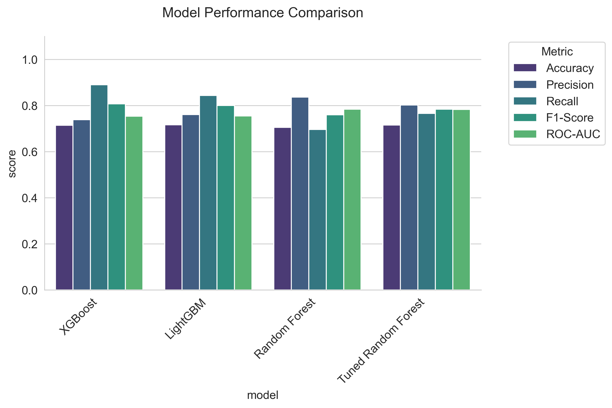
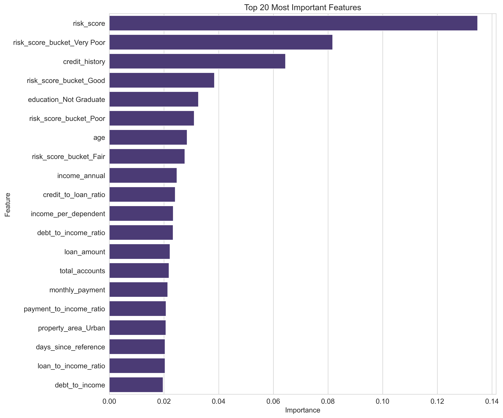

# Loan Risk Prediction Project

This project is an end-to-end machine learning application designed to predict the risk of loan default. It features a streamlined pipeline for data processing, model training, and deployment as an interactive web application.

## Project Structure

```
loan_risk_prediction/
├── data/
│   ├── raw/                # Raw data files
│   └── processed/          # Processed and encoded data
├── learning/               # Detailed project documentation
├── models/                 # Final model and artifacts
│   ├── final_model.joblib
│   ├── final_model_features.txt
│   └── scaler.joblib
├── reports/
│   ├── figures/            # Visualizations
│   └── eda_report.md
│   └── model_training_results.csv
├── scripts/
│   ├── data_utils.py
│   ├── eda.py
│   ├── feature_engineering.py
│   ├── generate_visualizations.py
│   └── model_training.py
├── app.py                  # Streamlit web application
├── requirements.txt
└── README.md
```

## Getting Started

### Prerequisites
- Python 3.8+
- pip

### Installation

1.  **Clone the repository:**
    ```bash
    git clone https://github.com/Parvathi201/Loan-Risk-Prediction.git
    cd Loan-Risk-Prediction
    ```

2.  **Create and activate a virtual environment:**
    ```bash
    # On Windows
    python -m venv venv
    .\venv\Scripts\activate

    # On macOS/Linux
    python3 -m venv venv
    source venv/bin/activate
    ```

3.  **Install dependencies:**
    ```bash
    pip install -r requirements.txt
    ```

## Usage

The project pipeline is designed to be run in a specific order. 

1.  **Run the full pipeline:**
    ```bash
    python -m scripts.feature_engineering
    python -m scripts.eda
    python -m scripts.model_training
    python -m scripts.generate_visualizations
    ```

2.  **Launch the Streamlit Web Application:**
    ```bash
    streamlit run app.py
    ```

## Model Performance

The final model is a tuned Random Forest classifier. Here are its performance metrics on the test set:

-   **Accuracy:** 73.1%
-   **Precision:** 80.9%
-   **Recall:** 78.6%
-   **F1-Score:** 0.797
-   **ROC-AUC:** 0.788

### Performance Visualizations

**Model Comparison**


**Feature Importance**


## Contributing

Contributions are welcome! Please feel free to submit issues and pull requests.

